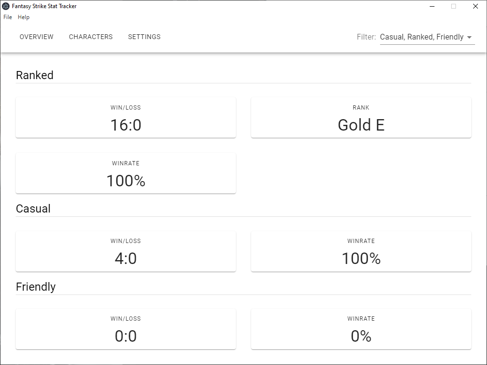

Current release: [Click here](https://github.com/grimkor/fs-stat-tracker/releases)

# FS Stat Tracker

FS Stat Tracker is a stat tracker for Fantasy Strike. By running in the background the FS Stat Tracker will record match and game results as they occur feeding back win:loss and rank for ranked and casual.

FS Stat Tracker achieves this by reading the game logs and storing results in a local database. All data is stored locally and not shared over the internet.

## Installation

There is no installation required for this, I have purposefully built this to run as a portable executable file.
Currently, there is only a Windows version of this however other versions can become available if there is demand.

The current release can be found here: [current release](https://github.com/grimkor/fs-stat-tracker/releases)

### How to use the FS Stat Tracker

It is important to run this program each time before running Fantasy Strike. With that in mind there is not much to it other than to extract the executable file and double-click.

Once the program has opened you will need to go to "Config" and fill in the "Log file" setting. This is typically found in `%USERPROFILE%/AppData/LocalLow/Sirlin Games/Fantasy Strike/output_log.txt`.

**Make sure you hit save!**

####** IMPORTANT NOTE **
The FS File Tracker stores its data in a database file found in the following locations:

**Windows**: _%USERPROFILE%/fs-stat-tracker.db_
\
**Linux**: _/home/user/fs-stat-tracker.db_

Deleting this file will mean deleting all tracked results.

## Development

### Install and run

You will need to install and use yarn for the following steps. Details on how to install yarn will not be enclosed.

`yarn install`
\
`yarn start`

Once running a database file will be created in

**Windows**: _%USERPROFILE%/fs-stat-tracker.db_
\
**Linux**: _/home/user/fs-stat-tracker.db_

After running go to config and point to the log file. This is typically found in `%USERPROFILE%/AppData/LocalLow/Sirlin Games/Fantasy Strike/output_log.txt`. Make sure to hit save.

### Building

`yarn install`
\
`yarn build`

Output should be in _<project_root>/packages_

## Issues & Bugs

If you run into any issues or bugs with the FS Stat Tracker then I urge you to raise an [issue](https://github.com/grimkor/fs-stat-tracker/issues/new) on this GitHub project and attach the output logs found at _%USERPROFILE%/fs-stat-tracker.log_. Please note this file resets every time the FS Stat Tracker is ran, so for the logs to be pertinent they must be from the last time the issue/bug occurred without re-running the application.
